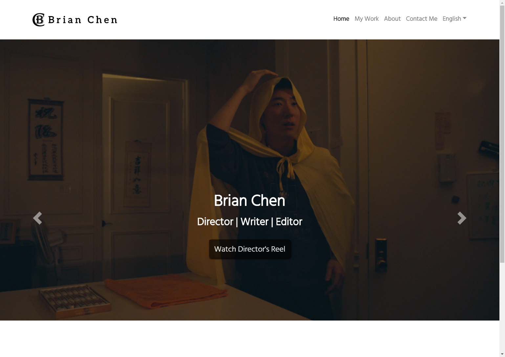
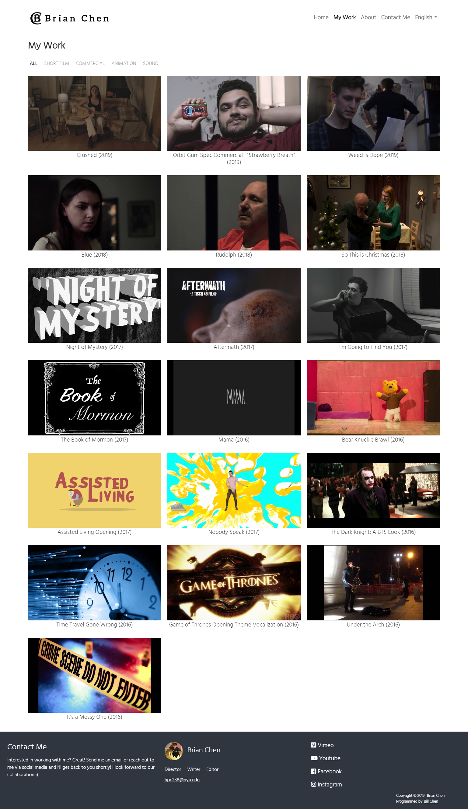
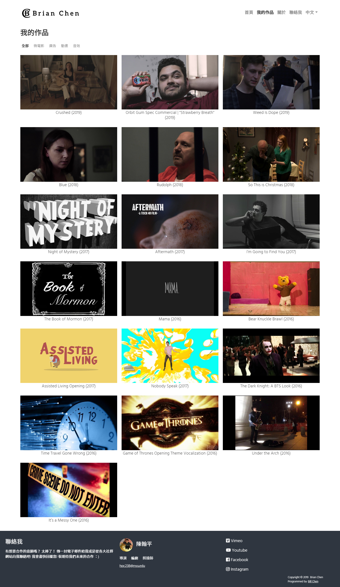
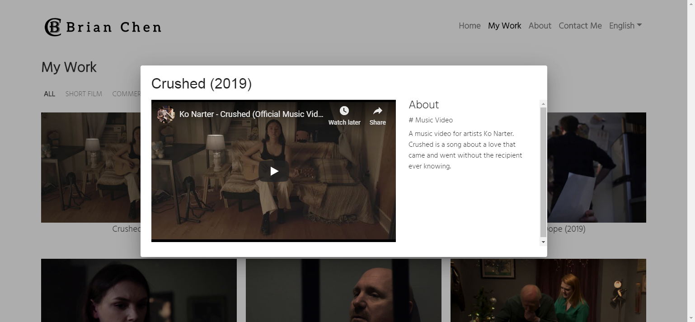
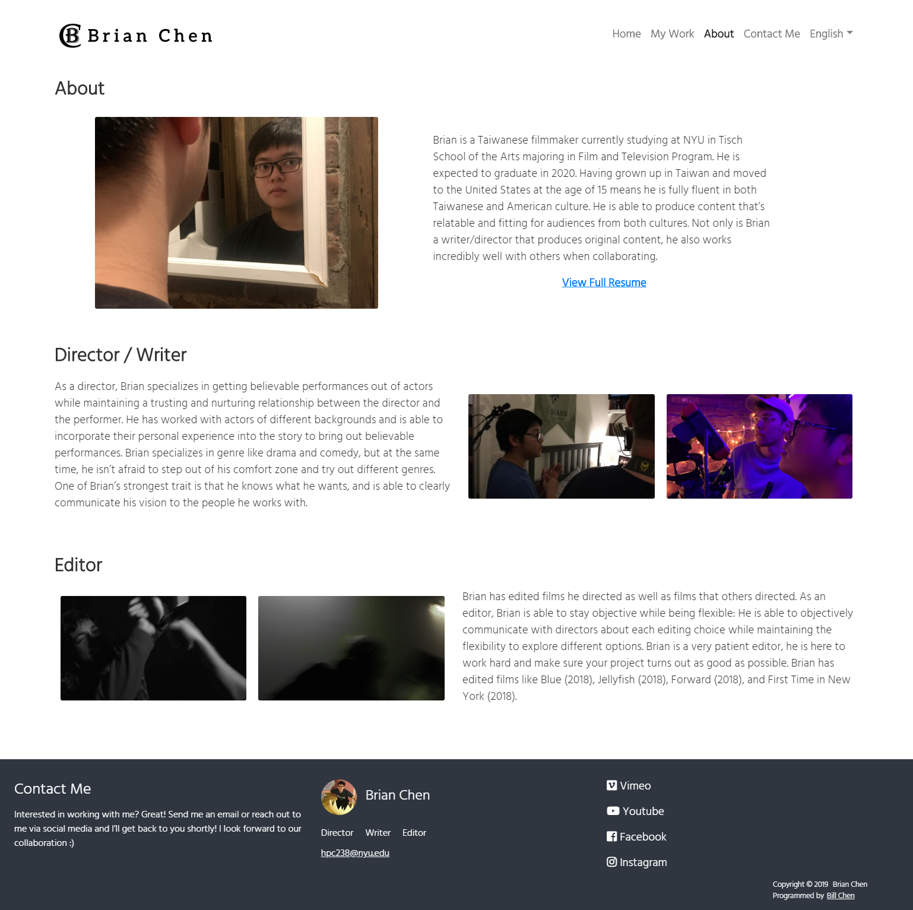

# film-portfolio

[Live Demo](https://www.brianchenfilm.com/)

## About
A static portfolio website made for film major to showcase his/her works.

## Tech Stacks

| Field               | Technology using                 |
| :------------------ | :------------------------------- |
| Remote Server       | Digital Ocean Droplet            |
| Server Machine      | Ubuntu 18.04.1                   |
| Frontend Technology | Angular 7 + SSR managed with pm2 |
| Other Libraries     | Bootstrap, NgxTranslate          |

## Website Features

* Hero image Carousel on home page showcasing feature works
* Work collection page with category filter
* About page for detail information of the person, including an external link for resume
* Footer across the entire website for external links to other social platforms
* Support multiple languages

---

### Home page

---

### Work Collection Page

---

### Work Collection Page (Chinese)

---

### Popup Dialog for Work Detail

---

### About Page

